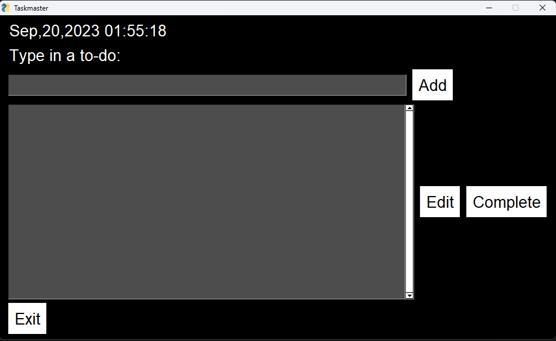

# Taskmaster
It is an application which lets you create your own to-do lists. Further customisations may be added in a future update. Windows Users may run the app directly on desktop through the executable inside `dist`

To add a task, type the task in the entry box and click _add_.
To edit an added task, select the task in the list shown. Write the updated task in the entry box and press _edit_.
To remove a completed task, select the task in the list shown and press _complete_.
Press _exit_ or the close window button to exit the app.
